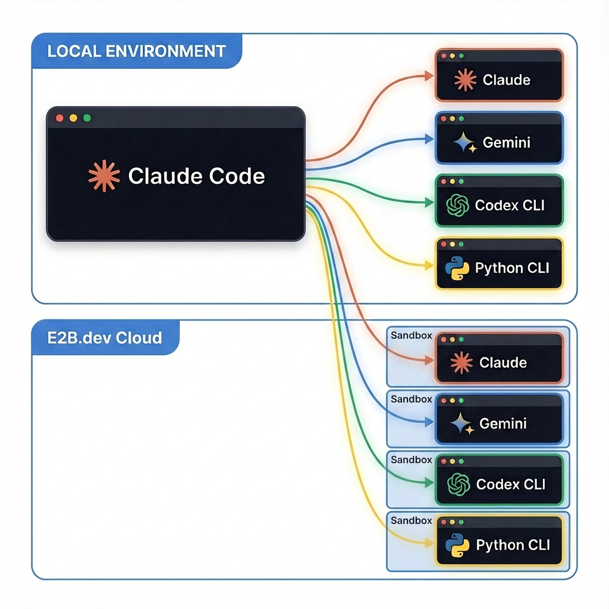

# Fork Terminal Skill
> A simple skill you can use to fork your agentic coding tools to a new terminal window.
>
> Why? To offload context (delegate), to branch work, to parallelize work, to run the same command against different tools + models, and more.
>
> Check out this [YouTube video](https://youtu.be/X2ciJedw2vU) where we build this skill from scratch.



A [Claude Code](https://docs.anthropic.com/en/docs/claude-code) skill that enables AI agents to spawn new terminal windows on demand. This skill extends Claude Code's capabilities to launch additional terminal sessions—including other AI coding assistants like Claude Code, Codex CLI, and Gemini CLI—in parallel terminals.

## Requirements

- [Claude Code](https://docs.anthropic.com/en/docs/claude-code)
- [Gemini CLI](https://github.com/google-gemini/gemini-cli)
- [Codex CLI](https://github.com/openai/codex)

## What is a Claude Code Skill?

Claude Code skills are **modular, context-aware capabilities** that extend what Claude can do. Unlike slash commands (which require explicit `/command` invocation), skills are **automatically discovered and invoked** by Claude when user requests match the skill's description.

Skills live in `.claude/skills/` directories and consist of:
- A `SKILL.md` file defining triggers, instructions, and workflow
- Supporting files (scripts, templates, documentation)

When you say something like "fork terminal to run tests with Claude Code", Claude automatically detects the matching skill, reads the instructions, and executes the workflow.

## Purpose

This skill allows you to:
- **Spawn parallel AI agents** in separate terminal windows
- **Run raw CLI commands** in new terminals
- **Pass conversation context** to forked agents (summary mode)

This is useful when you want Claude to delegate work to another agent running independently, or when you need to run long-running commands in a separate terminal.

## Supported Tools

| Tool            | Trigger Examples                      | Default Model          |
| --------------- | ------------------------------------- | ---------------------- |
| **Claude Code** | "fork terminal use claude code to..." | `opus`                 |
| **Codex CLI**   | "fork terminal use codex to..."       | `gpt-5.1-codex-max`    |
| **Gemini CLI**  | "fork terminal use gemini to..."      | `gemini-3-pro-preview` |
| **Raw CLI**     | "fork terminal run ffmpeg..."         | N/A                    |

### Model Modifiers

Each agentic tool supports model selection:
- **Default**: Uses the tool's default model
- **"fast"**: Uses a lighter, faster model (e.g., `haiku`, `gpt-5.1-codex-mini`, `gemini-2.5-flash`)
- **"heavy"**: Uses the most capable model

## Auto-Close Feature

The fork terminal skill supports an **auto-close** feature that automatically closes the terminal window/tab after the command completes. This is useful for quick tasks where you don't need to keep the terminal open.

### Usage

Add `auto-close` or `--auto-close` anywhere in your command:

```
# At the beginning
"fork terminal auto-close: ls -la"

# At the end
"fork terminal: npm test auto-close"

# With a flag
"fork terminal --auto-close use gemini to create hello.py"
```

### Behavior by Platform

| Platform    | Behavior                                                                 |
| ----------- | ------------------------------------------------------------------------ |
| **macOS**   | Creates terminal tab, waits for command completion, closes entire window |
| **Windows** | Uses `/c` flag to close window after command completion                 |

### Interactive Mode Handling

When auto-close is used with agentic coding tools (Claude Code, Codex CLI, Gemini CLI):
- **With auto-close**: Tools run in **non-interactive mode** (using `-p` flag) so the command exits after completion, allowing the terminal to close automatically
- **Without auto-close**: Tools run in **interactive mode** (default) to keep the session open for continued interaction

### Examples

```
# Quick directory listing
"fork terminal auto-close: ls -la"

# Run tests and close
"fork terminal auto-close: npm test"

# Generate a file with Gemini and close
"fork terminal auto-close use gemini to create hello.py"

# Run build with Claude Code and close
"fork terminal --auto-close use claude code to run the build"
```

## Usage Examples

### Examples you can run NOW

These examples work against this codebase. Generated files go to `temp/`.

**Claude Code**
```
# Analyze the skill architecture and save a report
"fork terminal use claude code to analyze SKILL.md and write a summary to temp/skill-analysis.md"

# Add Linux support to fork_terminal.py
"fork terminal use claude code to add Linux support to tools/fork_terminal.py, save changes to temp/fork_terminal_linux.py"

# Generate documentation for the Python tool
"fork terminal use claude code fast to read tools/fork_terminal.py and generate docstrings, save to temp/fork_terminal_documented.py"
```

**Codex CLI**
```
# Review the cookbook structure
"fork terminal use codex to review cookbook/*.md and write suggestions to temp/codex-cookbook-review.md"

# Generate a test file for the fork tool
"fork terminal use codex to read tools/fork_terminal.py and generate pytest tests, save to temp/test_fork_terminal.py"

# Analyze the SKILL.md workflow
"fork terminal use codex fast to analyze SKILL.md and explain the workflow in temp/workflow-explained.md"
```

**Gemini CLI**
```
# Document the skill's purpose
"fork terminal use gemini to read README.md and SKILL.md, write a one-pager summary to temp/gemini-summary.md"

# Suggest new cookbook entries
"fork terminal use gemini to review cookbook/ and suggest a new tool integration, save to temp/new-cookbook-idea.md"

# Analyze cross-platform support
"fork terminal use gemini fast to analyze tools/fork_terminal.py and recommend Linux implementation, save to temp/linux-recommendations.md"
```

**Raw CLI**
```
# List all skill files
"new terminal: find .claude/skills -name '*.md' | head -20"

# Watch for file changes
"fork terminal: watch -n 2 'ls -la .claude/skills/fork-terminal/'"
```

**Multi-Agent Combinations**
```
# Fork all three agents to review different aspects of the codebase
"fork terminal use claude code to review tools/fork_terminal.py and save analysis to temp/claude-tool-review.md,
 then fork terminal use codex to review SKILL.md and save analysis to temp/codex-skill-review.md,
 then fork terminal use gemini to review cookbook/*.md and save analysis to temp/gemini-cookbook-review.md"

# Race all three agents on the same task
"fork three terminals: claude code, codex, and gemini - each should read README.md and write improvement suggestions to temp/<agent>-readme-suggestions.md"

# Parallel documentation generation
"fork terminal use claude code to document tools/fork_terminal.py to temp/claude-docs.md,
 fork terminal use codex to document SKILL.md to temp/codex-docs.md,
 fork terminal use gemini to document the cookbook/ files to temp/gemini-docs.md"
```

**With Conversation Summary (Context Handoff)**
```
# Hand off your current conversation context to a new Claude Code agent
"fork terminal use claude code to request a new plan in temp/specs/<relevant-name>.md that details a net new cookbook file for a new agentic coding tool, summarize work so far"

# Delegate a subtask with full context to Gemini
"fork terminal use gemini to implement temp/specs/add-linux-support.md that details how to add Linux support to the fork terminal skill, include summary"
```

### Examples you can run later

These examples demonstrate usage patterns for other projects.

```
# Launch Claude Code for a refactor task
"fork terminal use claude code to refactor the auth module"

# Use a faster model for quick fixes
"fork terminal use claude code fast to fix the typo in utils.py"

# Launch Gemini CLI for test generation
"fork terminal use gemini to write tests for the API"

# Run a dev server in a new terminal
"create a new terminal to run npm run dev"

# Hand off context to a new agent
"fork terminal use claude code to implement the feature we discussed, summarize work so far"
```

## How It Works

1. **Trigger Detection**: Claude detects phrases like "fork terminal", "new terminal", or "fork session"
2. **Cookbook Selection**: Based on the requested tool, Claude reads the appropriate cookbook (e.g., `claude-code.md`)
3. **Command Construction**: Claude builds the command with proper flags (interactive mode, model selection, permission bypasses)
4. **Terminal Spawn**: The `fork_terminal.py` script opens a new terminal window and executes the command

## Architecture

```
.claude/skills/fork-terminal/
├── SKILL.md                    # Skill definition and workflow
├── cookbook/
│   ├── cli-command.md          # Raw CLI instructions
│   ├── claude-code.md          # Claude Code agent instructions
│   ├── codex-cli.md            # Codex CLI instructions
│   └── gemini-cli.md           # Gemini CLI instructions
├── prompts/
│   └── fork_summary_user_prompt.md  # Template for context handoff
└── tools/
    └── fork_terminal.py        # Cross-platform terminal spawner
```

## Platform Support

| Platform    | Status              | Method                     |
| ----------- | ------------------- | -------------------------- |
| **macOS**   | Supported           | AppleScript → Terminal.app |
| **Windows** | Supported           | `cmd /k` via `start`       |
| **Linux**   | Not yet implemented | —                          |

## Installation

Copy the `.claude/skills/fork-terminal/` directory to your project's `.claude/skills/` folder, or to `~/.claude/skills/` for personal use across all projects.

## Improvements

Ideas for future enhancements:

- **Focus spawned windows** - Bring new terminal windows to front automatically, or keep them in background based on user preference
- **More agentic coding tools** - Add cookbooks for OpenCode, and other agentic coding tools.
- **Whatever else you can think of** - Feel free to fork the terminal fork skill and make it your own.

## Master **Agentic Coding**
> Prepare for the future of software engineering

Learn tactical agentic coding patterns with [Tactical Agentic Coding](https://agenticengineer.com/tactical-agentic-coding?y=frktskl)

Follow the [IndyDevDan YouTube channel](https://www.youtube.com/@indydevdan) to improve your agentic coding advantage.
